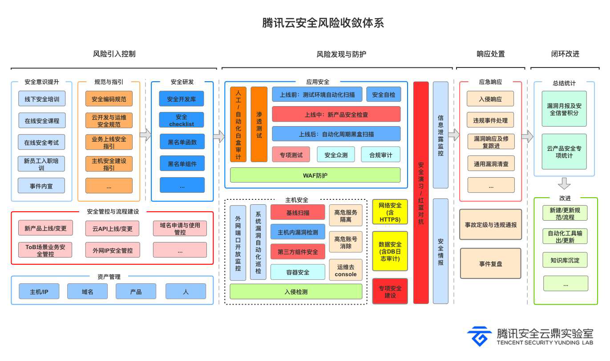

# Linux入侵排查

###1.检查登录历史与当前会话

```bash
last -  登录历史记录
\
lastb - 登录失败记录（需 /var/log/btmp）
\
who - 当前在线用户
```

<figure><figcaption></figcaption></figure>

###2.可疑进程与网络连接排查

```bash
ps -ef  / ps -aux 可以跟管道符grep敏感进程，如启用了bash等

如ps -ef | grep  "bash|sshd"
```

<figure><figcaption></figcaption></figure>

网络连接同样可以通过netstat -ano / netstat -tulnp配合grep查询

如检查连接netstat -ano | grep "127.0.0.1"

<figure><figcaption></figcaption></figure>

检查监听netstat -tulnp | grep  "127.0.0.1"

<figure><figcaption></figcaption></figure>

###3.定时任务和自启动任务排查

#### 检查 Cron 定时任务

```bash
crontab -l
ls -al /etc/cron* /var/spool/cron/
```

#### 检查自启动服务

```bash
systemctl list-unit-files | grep enabled
```

### 4.日志与文件异常排查

#### 1. 检查系统日志

```bash
journalctl -xe                      # 查看系统异常日志
less /var/log/auth.log             # 身份认证日志
```

#### 2. 查找可疑文件（Webshell、后门）

```bash
bash复制编辑find / -type f -name "*.php" -exec grep -i 'base64_decode' {} \; -print
grep -ri 'eval' /var/www/html
```

#### 3. 最近 3 天修改的文件

```bash
bash复制编辑find / -type f -mtime -3
```

### 5.命令历史与行为审计

```bash
cat /root/.bash_history
cat /home/用户名/.bash_history
#查看用户历史执行的shell命令
```
